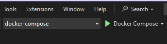
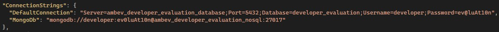

# Developer Evaluation Project
This is a Backend API developed using .NET Core 8 and VisualStudio 2022.

## How to run
Using Visual Studio 2022, run Docker Compose as shown in the image below:



Or run docker from the command line:
 ```bash
 docker-compose up --build
 ```

It is not necessary to run the `dotnet ef database update` command.

PS: If necessary, change the PostgreSQL and MongoDB connection strings in the appsettings.json file.


## Pagination, Sort and Filters

### Pagination
Pagination is supported for list endpoints using the following query parameters:

- `pageNumber`: Page number (default: 1)
- `pageSize`: Number of items per page (default: 10)

Example:
```
GET /api/Products?pageNumber=2&pageSize=20
```

### Ordering
Ordering is supported for list endpoints using the query parameter `orderBy` and `orderDirection`. 
Simply indicate the desired order: ascending (`asc`) or descending (`desc`)
Example:
```
GET /api/Products?orderBy=title&orderDirection=asc
```

### Filtering
Filters can be applied to list endpoints using the following query parameters:

- `field=value`: Filter by specific field value.

Example:

```
GET /api/Products?title=clothing&price=109.95
```

**String Fields**

To filter partial matches for string fields, use an asterisk (`*`) before or after the value.

Example:

```
GET /api/Products?title=Fjallraven*
GET /api/Products?category=*clothing
```

**Numeric and Date Fields**

To filter numeric or date fields by range, use `_min` and `_max` prefixes before the field name.

Example:

```
GET /api/Products?_minPrice=50
GET /api/Products?_minPrice=50&_maxPrice=200
```

## EventLogs
Sales event logs are stored in MongoDB in the SaleEventLogs collection.

## Technologies
- *.NET Core 8*
- *EF Core*
- *AutoMapper*
- *MediatR*
- *XUnit*
- *NSbstitute*
- *Faker*
- *Docker*
- *PostgreSQL*
- *MondoDB*
- *Redis*
